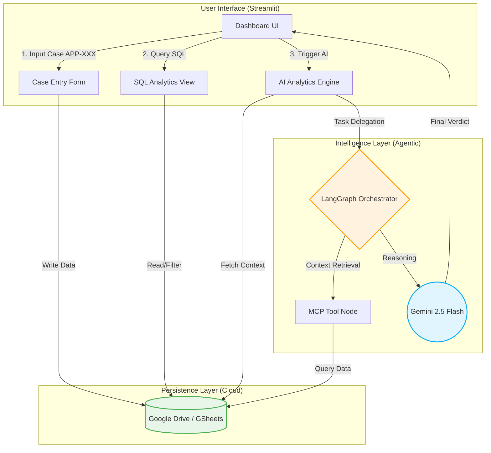

# Enterprise AI Context Engine: Fraud, Risk & Marketing Analytics


A high-performance Enterprise AI Context Engine engineered to unify financial risk management, fraud detection (AML), and marketing ROI analytics. This system features a robust Case Management System with cloud-native persistent storage and a built-in SQL analytics layer.

---

## 📋 Executive Summary
The system leverages an autonomous agent architecture to process multi-source data via the Model Context Protocol (MCP). Its primary objective is to deliver actionable insights across three critical domains: Fraud Detection, Credit Risk, and Marketing ROI Optimization.

## 🚀 Key Features
* Agentic Workflow Orchestration: Powered by LangGraph to manage complex, non-linear financial decision-making processes through deterministic state machines.
* Unified Case Management (CRUD): A dedicated interface for registering and managing customer cases (ID: APP-XXX), bridging the gap between raw data and AI analysis.
* Cloud-Native Persistence: Integrated with Google Drive API to use cloud spreadsheets as a persistent, accessible, and human-readable database.
* SQL Analytics Engine: Built-in SQL explorer using pandasql, enabling users to perform complex relational queries and filtering directly on the cloud data.
* Model Context Protocol (MCP): Implementation of a decoupled tool-calling layer to ensure secure and modular data retrieval from enterprise systems.
* Enterprise Performance Tuning: Optimized with Singleton Caching and WebSocket Compression for sub-2-second hot-reload latency in cloud proxy environments.

### 📂 Data Persistence & SQL Layer
The engine now features a complete Case Management System:
* **Google Drive Integration:** All input data is persisted in real-time to Google Drive (via GSheets/SQL bridge).
* **SQL-Based Querying:** Built-in SQL editor to perform complex analytics (e.g., filtering high-risk segments) using `pandasql`.
* **Dynamic Case Registration:** Register new application IDs (APP-XXX) that immediately become available for AI Analysis.

## 🏗️ System Architecture & Data Flow
The engine operates on a three-tier architecture: the UI Layer (Streamlit), the Persistence Layer (Google Drive SQL Bridge), and the Intelligence Layer (LangGraph & Gemini).
1. MCP Inference Node: Dynamically retrieves real-time data (e.g., marketing metrics, AML transaction history, or credit scores) based on contextual user input.
2. Strategist Node: Leverages the analytical capabilities of Gemini 2.5 Flash to synthesize the retrieved data into executive decision reports (e.g., [APPROVED], [REJECTED], or budget reallocation strategies).

### Visualisasi Alur Sistem


## 🚀 Tech Stack
* AI/LLM: Google Gemini 2.5 Flash
* Orchestration: LangGraph, LangChain
* Database Layer: Google Drive (GSheets), SQL (via pandasql)
* Frontend: Streamlit (Custom Tuned for WebSocket Stability)
* Validation: Pydantic v2

## 📖 Deployment Guide
Klik tombol di bawah ini untuk menjalankan *pipeline* secara penuh di Google Colab tanpa perlu setup lokal:

1. Environment Preparation:
Ensure all dependencies are installed. This project is highly optimized for cloud-native environments such as Google Colab or Docker containers.

```bash
pip install -r requirements.txt
```

2. Environment Configuration:
The system expects a Google Spreadsheet named Enterprise_AI_DB within your Google Drive to act as the primary database.

3. Launch the Engine:
Run the application with optimized production flags:

```bash
streamlit run app.py --server.port 8502 --server.enableWebsocketCompression true
```

4. SQL Querying:
Access the SQL Database View tab to execute queries such as:
`SELECT * FROM df WHERE risk_score > 75 AND status = 'Pending'`

5. UI Access:
Open the dashboard via a secure tunnel. If deployed on Colab, utilize the internal proxy: `output.serve_kernel_port_as_window(8502)`.

## 📈 Business Case (ROI)
The implementation of this system is designed to achieve:
* Instant Risk Mitigation: Early detection of anomalies in credit applications or high-risk marketing campaigns prone to Non-Performing Loans (NPL).
* Operational Efficiency (SLA): Slashes manual underwriting lead times from several days to mere seconds via the cache-optimized architecture. Reduces manual underwriting and fraud-review time by up to 85% via automated agentic reporting.
* Organizational Scalability: Empowers the R&D team to seamlessly integrate new, specialized agents into the State Machine without disrupting or refactoring the existing core system.
* Visibility: Centralizes siloed Risk and Marketing data into a single, SQL-searchable dashboard.

---

## ⚖️ License & Copyright
*   **Implementation Copyright:** © 2026 [Felix Yustian Setiono](https://linkedin.com/in/felixsetiono). The entire system architecture, API source code, and experimental analysis documents within this repository are the original intellectual property of the author.
