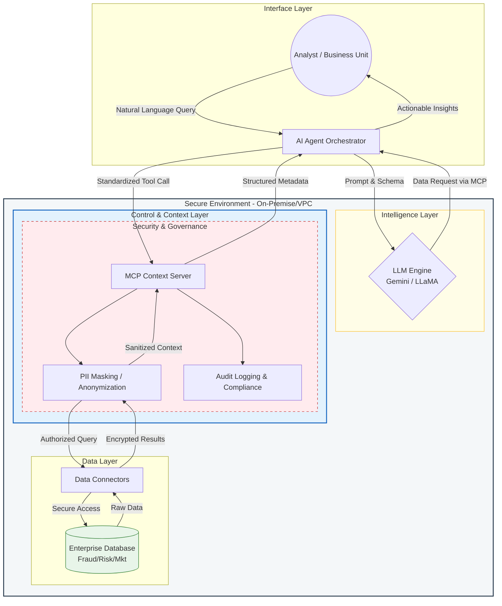

# Enterprise AI Agentic Workflow: Banking Risk & Compliance Engine

Repositori ini berisi prototipe fungsional Enterprise AI Context Engine yang dirancang untuk mengotomatisasi analisis risiko finansial dan strategi operasional menggunakan Agentic Workflow. Sistem ini mengintegrasikan data dinamis melalui Model Context Protocol (MCP) untuk pengambilan keputusan berbasis data secara real-time.

## 📋 Ringkasan Eksekutif
Proyek ini mendemonstrasikan kemampuan untuk menerjemahkan strategi AI perusahaan ke dalam roadmap yang dapat dieksekusi. Dengan menggabungkan data terstruktur (statistik perbankan) dan data tidak terstruktur (regulasi), sistem ini memberikan wawasan mendalam mengenai Risk Analytics, Marketing Analytics, dan Fraud Analytics.

Solusi ini dikembangkan untuk menjawab tantangan operasional di mana keputusan bisnis strategis sering kali terhambat oleh silo data antara tim pemasaran, risiko, dan kepatuhan (*compliance*).

## 🚀 Fitur Utama
Agentic Orchestration (LangGraph): Menggunakan state machine untuk mengelola alur kerja AI mulai dari ekstraksi data hingga laporan strategis akhir secara siklis dan terstruktur.

* MCP Tool Integration: Implementasi Model Context Protocol sebagai nilai tambah strategis untuk memisahkan logika bisnis dari inti model AI.
* RAG-Powered Insights: Menggunakan Retrieval-Augmented Generation (RAG) dengan Vector Database FAISS untuk analisis kepatuhan regulasi secara otomatis.
* Enterprise-Grade UI: Interface interaktif berbasis Streamlit yang mendukung injeksi API Key secara dinamis, memastikan keamanan data sensitif.

## 🏗️ Arsitektur Sistem
Sistem ini menggunakan alur kerja agen otonom (Agentic Workflow) yang terbagi menjadi tiga spesialisasi:

1.  **Data Analyst Agent:** Bertugas melakukan ekstraksi wawasan dari dataset tabular (menggunakan basis *UCI Bank Marketing Dataset*). Agen ini mengevaluasi metrik kunci seperti *conversion rate* dan profil saldo nasabah.
2.  **Compliance Officer Agent (RAG):** Mengimplementasikan **Retrieval-Augmented Generation (RAG)** menggunakan *Vector Database* **FAISS** dan **Gemini-Embedding-001**. Agen ini secara dinamis mencari aturan dalam regulasi internal atau OJK yang relevan dengan kueri bisnis.
3.  **Executive Manager Agent:** Bertugas sebagai orkestrator akhir yang mensintesis temuan dari kedua agen sebelumnya untuk menghasilkan rekomendasi strategis yang mitigatif terhadap risiko.

## Tech Stack
* Core: Python 3.12+
* AI Orchestration: LangChain & LangGraph
* LLM & Embedding: Google Gemini 2.5 Flash & Gemini-Embedding-001
* Data Science: Pandas, Scikit-Learn (Isolation Forest untuk Fraud Detection)
* Deployment: Streamlit via Google Colab Native Proxy

## 📖 Cara Menjalankan (Google Colab)
Klik tombol di bawah ini untuk menjalankan *pipeline* secara penuh di Google Colab tanpa perlu setup lokal:

1. Buka Notebook di Google Colab.

2. Masukkan Gemini API Key Anda.
3. Jalankan semua sel (*Run All*).
4. Akses Dashboard: Gunakan tautan `googleusercontent.com` yang dihasilkan, masukkan API Key Gemini Anda di sidebar, dan mulai analisis.

## 📈 Kasus Bisnis (ROI)
Implementasi sistem ini ditujukan untuk mencapai:
* **Reduksi Risiko:** Deteksi dini potensi pelanggaran regulasi sebelum kampanye dijalankan.
* **Peningkatan ROI Pemasaran:** Memastikan target kampanye sesuai dengan profil risiko perbankan yang sehat.
* **Skalabilitas:** Memungkinkan tim R&D untuk menambah agen baru (misalnya: *Fraud Detection Agent*) tanpa merusak alur kerja utama.

---

## ⚖️ License & Copyright

*   **Implementation Copyright:** © 2026 [Felix Yustian Setiono](https://linkedin.com/in/felixsetiono). The entire system architecture, API source code, and experimental analysis documents within this repository are the original intellectual property of the author.
