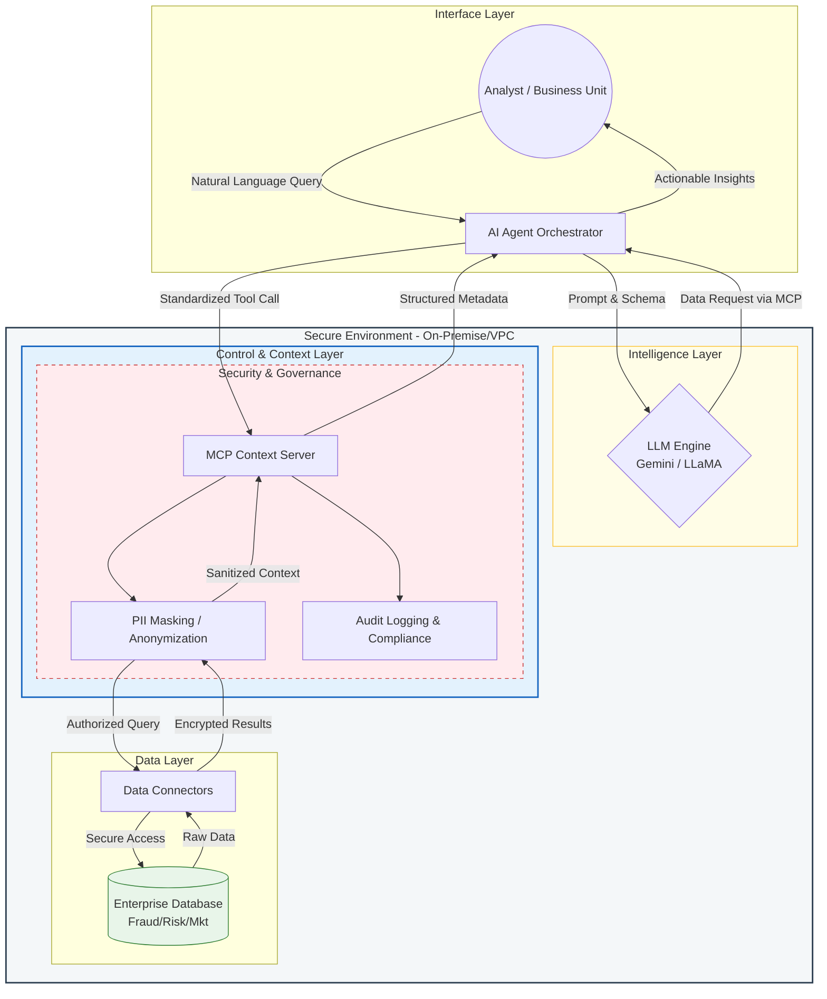

# Enterprise AI Context Engine: Fraud, Risk & Marketing Analytics


This repository contains the implementation of the Enterprise AI Context Engine, engineered to automate financial risk analysis, fraud detection, and marketing strategies using Agentic Workflows. This system operates with ultra-low latency and is built for large-scale, resilient cloud infrastructure.
---



---

## 📋 Executive Summary
The system leverages an autonomous agent architecture to process multi-source data via the Model Context Protocol (MCP). Its primary objective is to deliver actionable insights across three critical domains: Fraud Detection, Credit Risk, and Marketing ROI Optimization.

## 🚀 Key Features
* Agentic Orchestration (LangGraph): Manages complex workflows through a deterministic State Machine, ensuring structured and reliable agent execution.
* Ultra-Fast Execution (Singleton Caching): Utilizes Lazy Loading and in-memory caching architecture (@st.cache_resource). LLM models and graph infrastructures are initialized exactly once, yielding hot-reload inference times under 2 seconds.
* Resilient Cloud Infrastructure: Implements Port Pivoting and WebSocket Compression to ensure stable deployments, completely bypassing network bottlenecks or 404 errors in containerized/proxy environments.
* MCP Tool Integration: Strictly decouples data retrieval logic (e.g., Core Banking or Credit Bureau API connections) from the core LLM reasoning engine using the latest industry protocol standards.
* Zero-Hardcoded Secrets: Secures API Keys and sensitive credentials through dynamic Dependency Injection within the user interface, adhering to DevSecOps best practices.

## 🏗️ Agentic Architecture
The system operates sequentially through critical nodes within the directed graph:
1. MCP Inference Node: Dynamically retrieves real-time data (e.g., marketing metrics, AML transaction history, or credit scores) based on contextual user input.
2. Strategist Node: Leverages the analytical capabilities of Gemini 2.5 Flash to synthesize the retrieved data into executive decision reports (e.g., [APPROVED], [REJECTED], or budget reallocation strategies).

## 🚀 Tech Stack
* AI Core: Google Gemini 2.5 Flash
* Orchestration: LangGraph & LangChain
* Backend Logic: Python 3.12, Pydantic (v2)
* Frontend & Deployment: Streamlit (Optimized for WebSocket/Proxy routing)

## 📖 Deployment Guide
Klik tombol di bawah ini untuk menjalankan *pipeline* secara penuh di Google Colab tanpa perlu setup lokal:

1. Environment Preparation:
Ensure all dependencies are installed. This project is highly optimized for cloud-native environments such as Google Colab or Docker containers.

2. Backend Initialization:
Run the `engine.py` module to build the LangGraph architecture and the simulated MCP server.

3. Server Launch (Optimized):
The application is explicitly configured to run on Port 8502 with data compression enabled. Execute the following command:

```bash
streamlit run app.py \
  --server.port 8502 \
  --server.headless true \
  --server.enableCORS false \
  --server.enableXsrfProtection false \
  --server.enableWebsocketCompression true \
  --browser.gatherUsageStats false
```

4. UI Access:
Open the dashboard via a secure tunnel. If deployed on Colab, utilize the internal proxy: `output.serve_kernel_port_as_window(8502)`.

## 📈 Business Case (ROI)
The implementation of this system is designed to achieve:
* Instant Risk Mitigation: Early detection of anomalies in credit applications or high-risk marketing campaigns prone to Non-Performing Loans (NPL).
* Operational Efficiency (SLA): Slashes manual underwriting lead times from several days to mere seconds via the cache-optimized architecture.
* Organizational Scalability: Empowers the R&D team to seamlessly integrate new, specialized agents into the State Machine without disrupting or refactoring the existing core system.

---

## ⚖️ License & Copyright
*   **Implementation Copyright:** © 2026 [Felix Yustian Setiono](https://linkedin.com/in/felixsetiono). The entire system architecture, API source code, and experimental analysis documents within this repository are the original intellectual property of the author.
