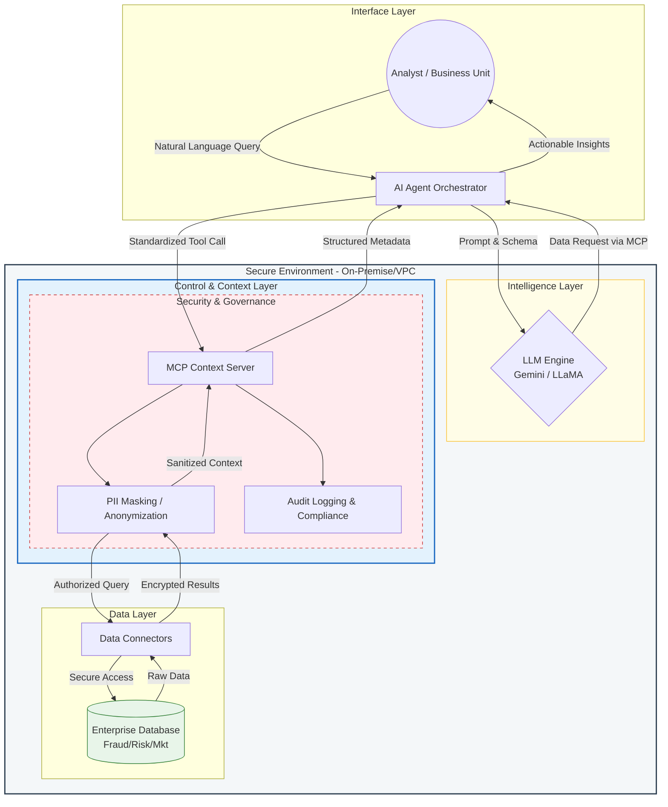

# Enterprise AI Context Engine: Fraud, Risk & Marketing Analytics


This repository contains the implementation of the Enterprise AI Context Engine, designed to automate financial risk analysis, fraud detection, and marketing strategies using Agentic Workflows. This project demonstrates how an enterprise-level AI strategy can be translated into an executable roadmap using state-of-the-art agent orchestration technologies.

---



---

## 📋 Executive Summary
The system utilizes an autonomous-agent architecture to process data from various sources via the Model Context Protocol (MCP). Its primary focus is to deliver actionable insights across three critical domains: Fraud Detection, Credit Risk, and Marketing ROI Optimization.

## 🚀 Key Features
* Agentic Orchestration (LangGraph): Manages complex workflows through a State Machine, ensuring every step (from data retrieval to executive reporting) runs deterministically and structurally.
* MCP Tool Integration: Utilizes industry-standard protocols to decouple data retrieval logic (tool calling) from the core LLM, guaranteeing data security and system scalability.
* Dependency Injection Security: Implements dynamic API Key management via the UI, avoiding hardcoded sensitive keys in the source code to strictly comply with enterprise security standards.
* Enterprise-Grade UI: An interactive interface built with Streamlit, optimized for secure, frictionless access via internal proxy mechanisms.

## 🏗️ Agentic Architecture
The system operates with two primary nodes within the directed graph:
1. MCP Inference Node: Responsible for fetching real-time risk metrics based on user queries (e.g., analyzing the viability of a specific marketing campaign).
2. Strategist Node: Leverages Gemini 2.5 Flash to synthesize raw technical data into a comprehensive managerial strategy report, encompassing risk mitigation recommendations and financial forecasts.

## 🚀 Tech Stack
* AI Core: Google Gemini 2.5 Flash
* Orchestration: LangGraph & LangChain
* Backend Logic: Python 3.12, Pydantic (v2)
* Data Science: Pandas & NumPy
* Frontend Deployment: Streamlit

## 📖 How to Run (via Google Colab)
Klik tombol di bawah ini untuk menjalankan *pipeline* secara penuh di Google Colab tanpa perlu setup lokal:

1. Install Dependencies:
Ensure all required libraries (LangChain, LangGraph, Streamlit) are installed in your environment.

2. Initialize Engine:
Run the cell that writes the `engine.py` file to configure the agent architecture.

3. Launch UI:
Start the application using the following command:

```bash
!streamlit run app.py --server.port 8501 --server.headless true
```

4. Access Dashboard:
Utilize Google Colab's native output.serve_kernel_port_as_window(8501) feature to open the interface securely, bypassing local firewall or antivirus restrictions.

## 📊 Example Output
The system is capable of instantly detecting correlations between marketing campaigns and risk profiles:
* Findings: Campaign "CAMP_B" exhibits a Fraud Score of 0.45 and an NPL (Non-Performing Loan) Risk of 0.12.
* Strategic Recommendation: The AI agent recommends tightening automated KYC verification on this specific channel and suggests reallocating the marketing budget to organic channels to maintain the company's financial stability.

## 📈 Business Case (ROI)
The implementation of this system is designed to achieve:
* Risk Mitigation: Early detection of potential regulatory violations before campaign execution.
* Enhanced Marketing ROI: Ensuring campaign targets align with a healthy and sustainable banking risk profile.
* Scalability: Empowering the R&D team to seamlessly integrate new specialized agents (e.g., Fraud Detection Agent) without disrupting the core workflow.
---

## ⚖️ License & Copyright
*   **Implementation Copyright:** © 2026 [Felix Yustian Setiono](https://linkedin.com/in/felixsetiono). The entire system architecture, API source code, and experimental analysis documents within this repository are the original intellectual property of the author.
